# Processo e decisões do trio: ShelfLife (Trabalho 2, MAF)

## Como estava o projeto no Trabalho 1 e o que mudou

No Trabalho 1 o ShelfLife era um conjunto de telas estilizadas, todas dentro do `MainActivity.kt`, com dados fixos no código e botões que não faziam nada. Para chegar ao MAF criamos a navegação de verdade (`NavHost`, objeto `Rotas` e `NavigationBar`), duas listas reativas com `mutableStateListOf`, uma de amigos e outra de livros, nas quais dá para adicionar e remover itens, e telas de detalhes que recebem o id do item pela rota. O código também saiu da `MainActivity.kt` e foi para arquivos próprios. Hoje o app tem nove telas conectadas.

## Por que essas telas e o que cada uma faz

Partimos do rascunho de papel do grupo e escolhemos as telas que ajudam o app a cumprir o seu objetivo: acompanhar a própria leitura e se comparar com amigos. As duas listas do enunciado são a de amigos, com a data class `Amigo`, e a estante, com a data class `Livro`. As outras telas são detalhes ou visões criadas em cima dessas duas listas.

### Home

A Home é o resumo do app: mostra o tempo total lido, os livros principais, um campo para adicionar um livro rapidamente e uma prévia do ranking com as fotos dos amigos que mais leram.

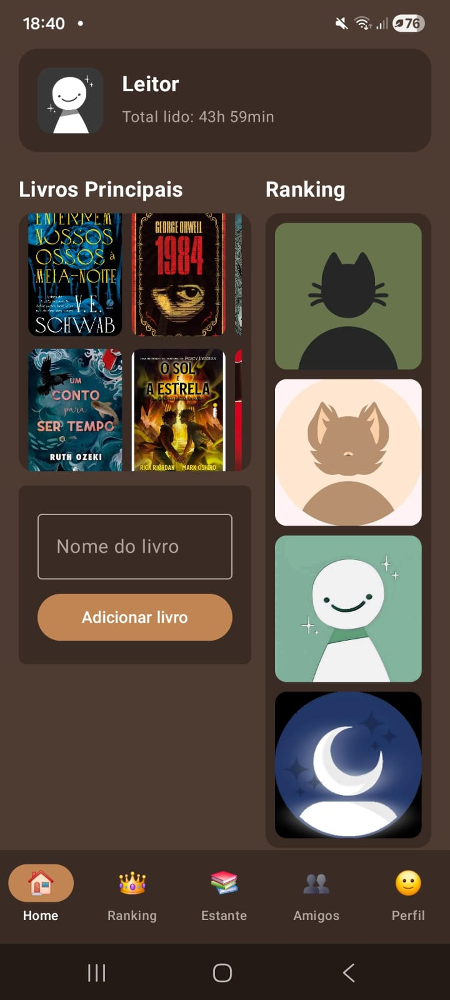

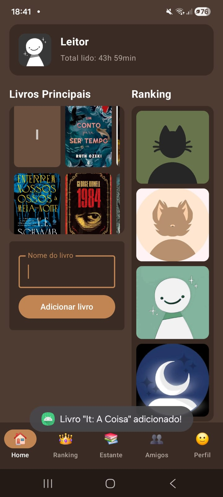

### Ranking

O Ranking lista os amigos ordenados por tempo de leitura, livros lidos ou sequência de dias, com busca por nome. A ordenação acontece antes do filtro, para que a posição de cada amigo continue sendo a real quando se busca um nome. Tocar num amigo abre o detalhe dele e segurar o toque abre a confirmação para removê-lo.

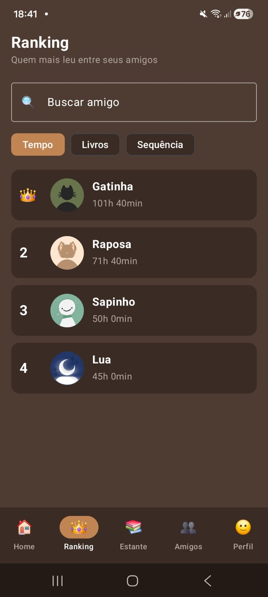
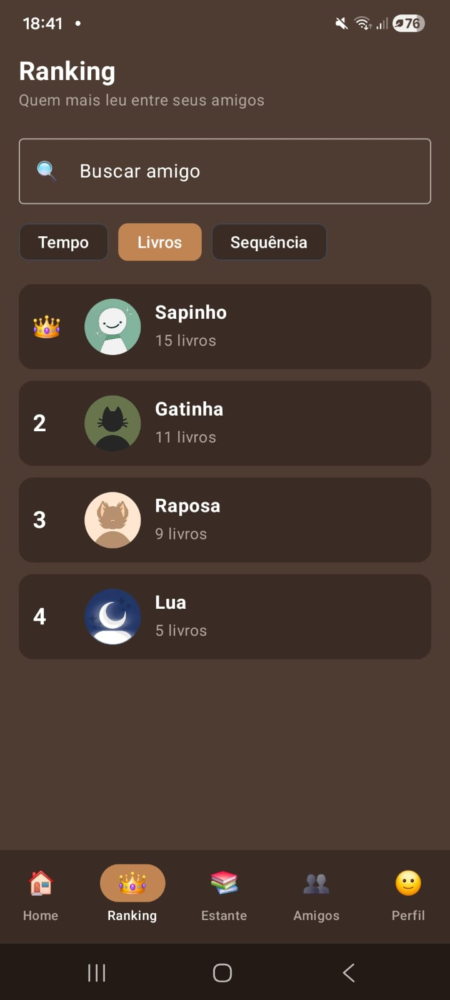

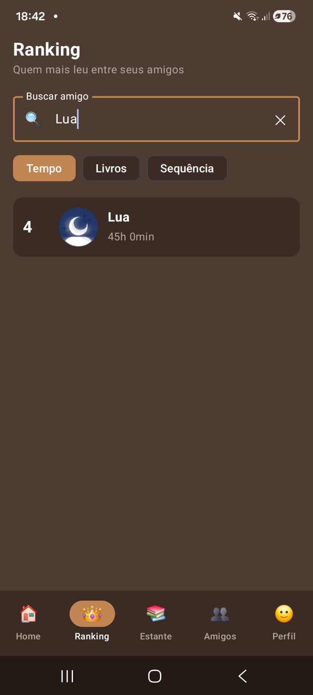

### Estante

A Estante é a segunda lista do enunciado: cada livro aparece em um `Card` dentro de uma `LazyColumn`, com capa, título, autor e barra de progresso, e há uma busca por título. O botão Adicionar livro abre uma tela com o formulário (título, autor e total de páginas), e tocar num livro abre o detalhe dele. Trocamos a grade de capas do Trabalho 1 por uma lista de cartões para seguir o que o enunciado pede.

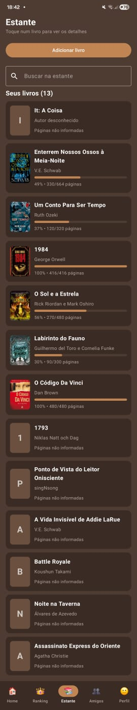

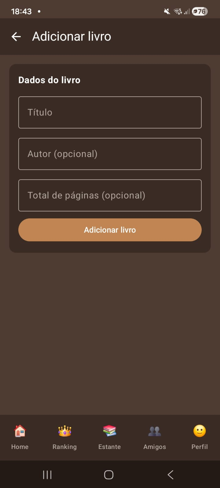

### Amigos

A tela de Amigos é o cadastro: o usuário busca outra pessoa pelo nome, toca em Adicionar e ela entra na lista de amigos, onde cada cartão tem um botão para remover e abre o detalhe quando tocado. O detalhe do amigo mostra os números dele, a posição entre os amigos e uma nota pessoal que pode ser salva.

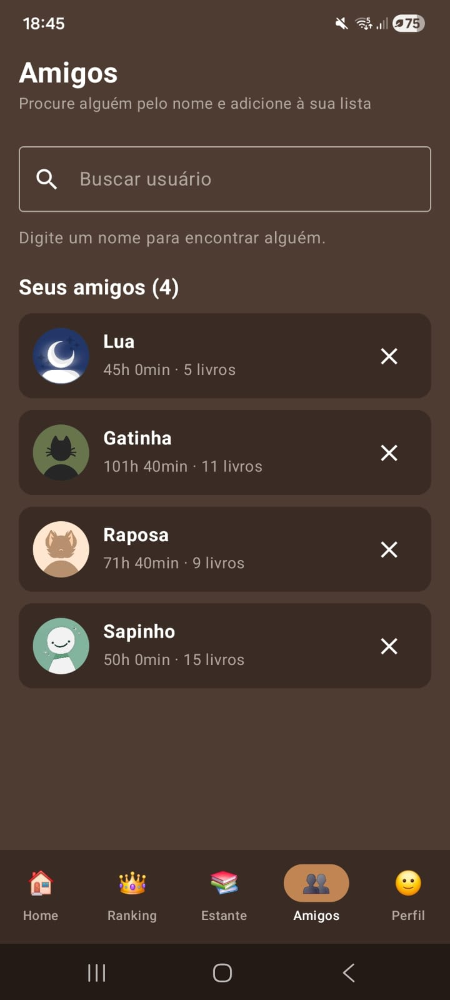
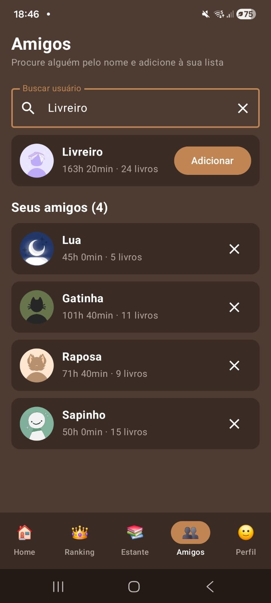

### Detalhe do livro e anotações

O detalhe do livro mostra capa, progresso, tempo lido, previsão de término e um formulário para registrar a leitura, além da opção de remover o livro. O botão Anotações abre uma tela com campo de várias linhas para escrever sobre aquele livro, criada para que o botão tenha uma função real.

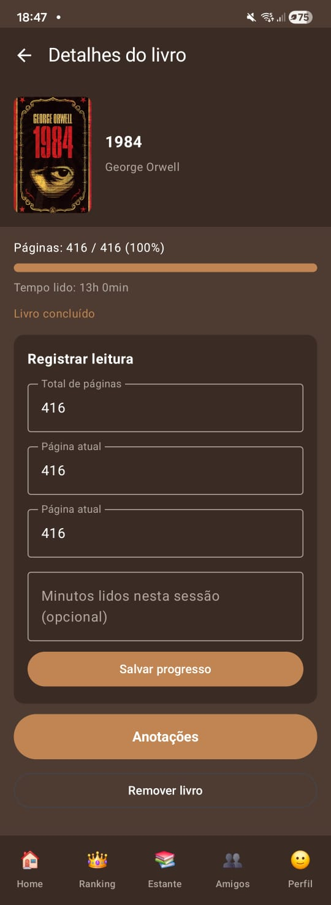
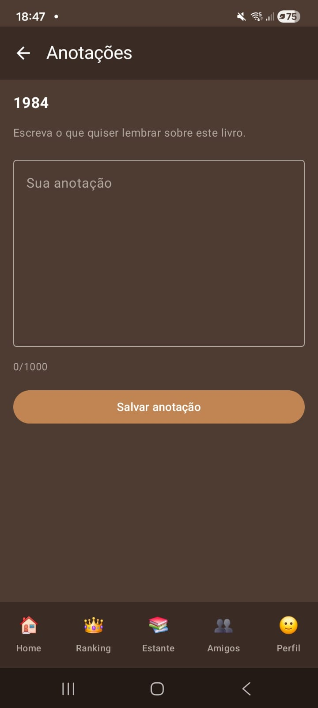

### Perfil

O Perfil junta dados das duas listas: o tempo total é a soma dos livros, o nível é calculado a partir desse tempo, e o texto "você leu mais que X dos seus N amigos" compara o tempo dos livros com o de cada amigo. As setas levam à Estante e à tela de Amigos, e tocar numa capa ou numa foto abre o detalhe correspondente.

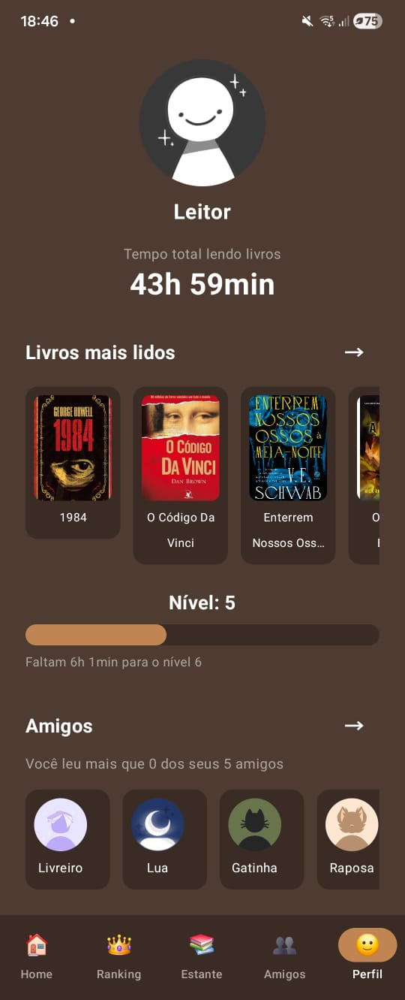

## Decisões de configuração e organização do código

Todas as rotas ficam num objeto `Rotas`, como `const val` do tipo String, e o `NavHost` com a `NavigationBar` fica inteiro em um único arquivo, o `AppNavigation.kt`, o que deixa fácil ver quais telas existem e como se ligam. As rotas de detalhe recebem o id como argumento, por exemplo `detalhe_amigo/{amigoId}`, e a tela de destino usa esse id para buscar o item certo na lista.

A decisão mais importante foi onde guardar as listas: criamos uma única lista de amigos e uma única de livros dentro do `AppNavigation`, e cada tela recebe a lista e funções como `aoAdicionar` e `aoRemover` por parâmetro. Assim, mudar um dado em uma tela muda todas as outras na hora. A `MainActivity.kt` ficou só com a chamada ao `AppNavigation`, e o restante foi separado em pastas por função (telas, modelos, componentes e utilitários). Cada parte do trabalho foi feita numa branch própria e juntada na `main` com commit de merge. Os livros e as anotações ficam só em memória, o que o enunciado aceita neste trabalho.

## Complexidade extra na tela de Detalhes

No detalhe do livro, a tela permite editar o item ali mesmo e mostra uma informação calculada: o usuário registra o total de páginas, a página atual e os minutos da sessão, e a previsão de término sai do ritmo dele (tempo lido vezes páginas restantes, dividido pelas páginas já lidas). Escolhemos isso porque o tempo registrado alimenta também o Perfil e a Home. No detalhe do amigo, a tela calcula a posição dele entre os amigos em tempo, livros e sequência e o tempo médio por livro, o que combina com o tema de se comparar com os amigos.

## Dificuldades e como resolvemos

Ao adicionar a biblioteca de navegação, o Gradle falhou na sincronização porque a linha da biblioteca estava na seção `[plugins]` do `libs.versions.toml` e não em `[libraries]`; movemos a linha e sincronizou. Depois, ao tocar na aba Perfil após usar as setas dela, abria a Estante ou o Ranking em vez do Perfil. A causa era o uso de `saveState` e `restoreState` na barra de baixo, que restauram a pilha inteira da aba; removemos essas opções e deixamos só `popUpTo` e `launchSingleTop`.

Também percebemos ao testar que a tela de Amigos tinha uma lista própria e o Ranking usava outra, então um amigo adicionado não aparecia no ranking. Resolvemos levando a lista para o `AppNavigation` e mudando as assinaturas das telas de amigos junto com quem as tinha feito.
